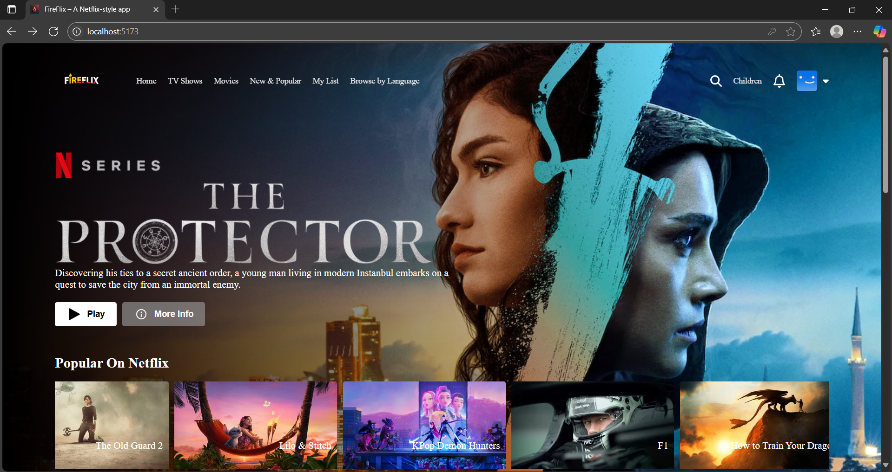
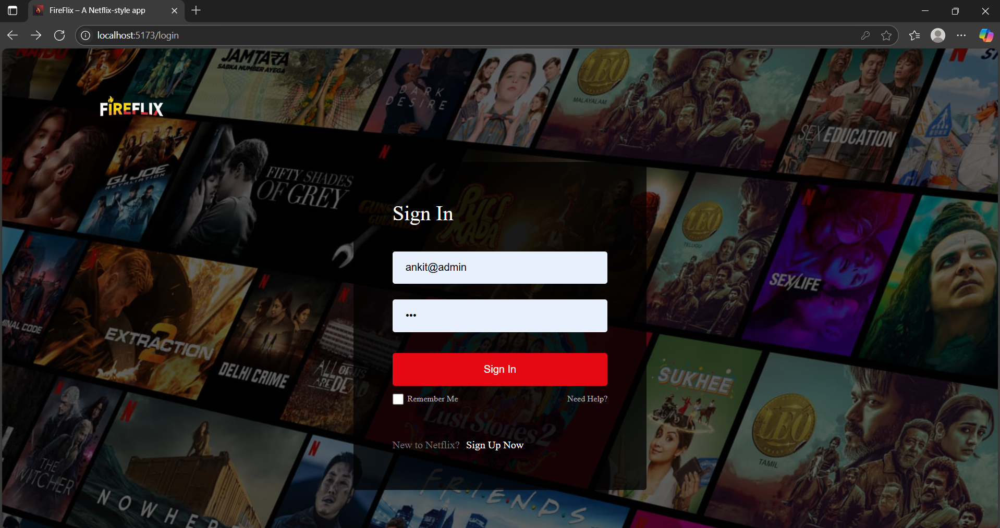
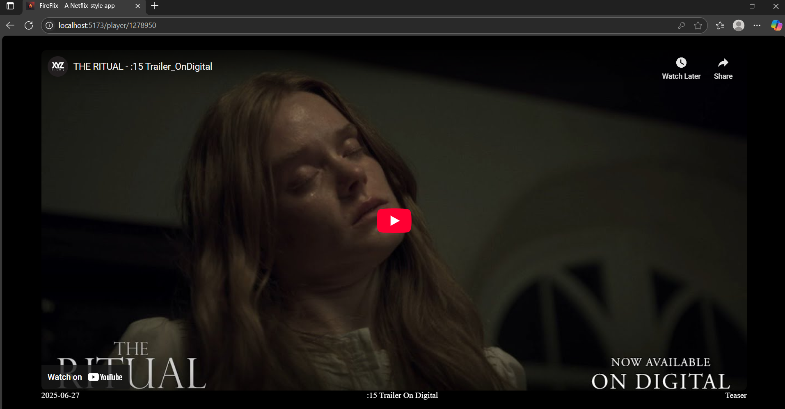

# 🔥 FireFlix – Netflix Clone using React.js & Firebase

FireFlix is a full-stack, responsive Netflix clone built using **React.js**, **Firebase**, and the **TMDB API**. Users can browse movies, authenticate (login/signup), and save their favorites to a watchlist.

---

## 🖼️ Screenshots

| Home Page                        | Login Page                       | Movie Detail Page               |
|----------------------------------|----------------------------------|----------------------------------|
|  |  |  |

> _Place your images inside a `/screenshots` folder in your repo._

---

## 🚀 Live Demo

🌐 [https://fireflix.web.app](https://fireflix.web.app)  
(or update with your deployed Firebase URL)

---

## 🛠️ Tech Stack

- **Frontend**: React.js, React Router DOM, TailwindCSS
- **Backend**: Firebase Firestore
- **Authentication**: Firebase Auth (Email/Password, Google OAuth)
- **Movie Data**: [TMDB API](https://www.themoviedb.org/documentation/api)
- **Hosting**: Firebase Hosting

---

## ✨ Features

- 🔐 User Authentication (Email & Google)
- 🎬 Browse movies and TV shows
- 💾 Save movies to personalized watchlist
- 🔎 Search functionality
- 🧠 TMDB API integration
- ⚡ Fast and responsive UI with TailwindCSS
- 🛡️ Protected routes and persistent auth state

---

## 📦 Folder Structure

FireFlix/
├── public/
├── src/
│   ├── assets/
│   ├── components/
│   ├── pages/
│   ├── context/
│   ├── firebase.js
│   └── App.js
├── .env
├── .gitignore
├── package.json
├── tailwind.config.js
└── README.md


---


---

## 🧪 Getting Started

### 1. Clone the repo
```bash
git clone https://github.com/Ankitsgit/FireFlix.git
cd FireFlix

2. Install dependencies

3. Set up Firebase
Create a .env file in the root directory and paste your Firebase config:

npm install

REACT_APP_FIREBASE_API_KEY=your_key
REACT_APP_FIREBASE_AUTH_DOMAIN=your_domain
REACT_APP_FIREBASE_PROJECT_ID=your_id
REACT_APP_FIREBASE_STORAGE_BUCKET=your_bucket
REACT_APP_FIREBASE_MESSAGING_SENDER_ID=your_sender_id
REACT_APP_FIREBASE_APP_ID=your_app_id


🚀 Run the App Locally
bash
Copy code

npm run dev
